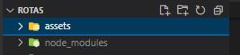
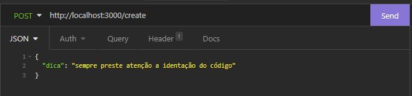
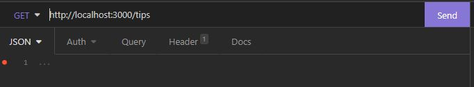

# Node Express

Projeto da segunda sprint do quarto módulo do curso de Web Dev. FullStack da Resilia,a proposta é a de criar uma aplicação que vai auxiliar desenvolvedores no dia a dia. A aplicação foi d esenvolvida em Node, onde irá receber pelo metodo POST dicas para desenvolvedores e retornar uma dica aleatória pelo metodo GET.

## 🚀 Começando

Essas instruções permitirão que você obtenha uma cópia do projeto em operação na sua máquina local para fins de desenvolvimento e teste.

Consulte **Executando a aplicação** para saber como utilizar o projeto.

### 📋 Pré-requisitos

O que você precisa para instalar o software e como instalá-lo?

```
Node.js Versão 16.15.1 (Que no momento é a versão LTS)
Express (Biblioteca utilizada no Node).
```

### 🔧 Instalação

Uma série de exemplos passo-a-passo que informam o que você deve executar para ter um ambiente de desenvolvimento em execução.

**Instalação do Node e Express:**


***Windows:***


Você pode baixar direto pelo site: [node](https://nodejs.org/en/)

Ou então via Chocolatey:
```
choco install nodejs-lts
```

***Mac:***

Você pode baixar direto pelo site: [node](https://nodejs.org/en/)

***Linux*** 

via apt e snap:

```
sudo apt-get install curl

curl -fsSL https://deb.nodesource.com/setup_lts.x | sudo -E bash -

sudo apt-get install -y nodejs
```

Após a instalação do Node utilizaremos os comandos do NPM (Node Package Manager) no terminal para instalar a biblioteca Express:

```
npm i express
```
Após a instalação você ele deve ter baixado uma pasta chamada node_modules conforme abaixo:

.

#### Instralação da ferramenta Insomnia (utilizada para testar as rotas da API):

***Windows:***

Você pode baixar pelo site: [Insomnia](https://insomnia.rest/download)

ou então via Chocolatey
```
choco install insomnia-rest-api-client
```
***Mac:***

via brew:
```
brew install --cask insomnia
```

***Linux:***

via snap:
```
snap install insomnia
```

## ⚙️ Executando a aplicação

Para executar o teste você deve inserir o comando start do npm:

```
npm start
```
então irá aparecer no terminal a mennsagem que o servidor está rodando com o link para acesso das rotas, o comando de post deve ser executado na rota /create e o comando get deve ser rodado na rota /tips

Exemplo de como devem ser executados os comandos: 


Para adicionar uma dica deve-se acessar a rota /create e passar um objeto JSON conforme abaixo:

``` 
    {
        "dica": "sua dica aqui"
    }

    Exemplo:
    {
        "dica": "sempre atente-se a identação do código"
    }

```

conforme o exemplo a seguir:



e o valor colocado na chave irá ser adicionado ao final do banco de dados simulado:


depois acesse a rota tips e utilize o metodo GET para retornar uma dica aleatória do banco:



e a dica irá retornar dessa maneira:


Para derrubar o servidor e liberar o terminal é só utilizar o comando:
```
ctrl + c
```


## 🛠️ Construído com

Ferramentas utilizadas:

* [Express](https://expressjs.com/pt-br/guide/routing.html)
* [Node](https://nodejs.org/en/docs/)

## ✒️ Autores

Projeto desenvolvido em conjunto pelo Squad 1:

* **Fernando Patrick** - *Gestor de Conhecimento* - [FernandoPatrick](https://github.com/FernandoPatrick)
* **Flávio Christovam** - *Desenvolvedor* - [fchristovam](https://github.com/fchristovam)
* **João Paulo** - *Desenvolvedor* - [Joao-P-G-Begiato](https://github.com/Joao-P-G-Begiato)
* **Lucas Passos** - *Gestor de Gente* - [LucasBinho](https://github.com/LucasBinho)
* **Rafael Jordão** - *Co-Facilitador* - [rafaelljordao](https://github.com/rafaelljordao)

## 📄 Licença

Este projeto está sob a licença MIT - veja o arquivo [LICENSE](https://github.com/Joao-P-G-Begiato/Dev-tips/blob/main/LICENSE) para detalhes.


## 🎁 Expressões de gratidão

* Aos colegas desenvolvedores que participaram desse projeto (listados acima);
* A Cinthia Cantú que me trouxe para esse universo incrível que é a programação.
* Aos facilitadores Tech Jarom Aidukaitis e Leonardo Costa que me acolheram nesse universo.
* A facilitadora Anna Carolina Souza que me deu força nos momentos mais tortuosos dessa jornada.

---